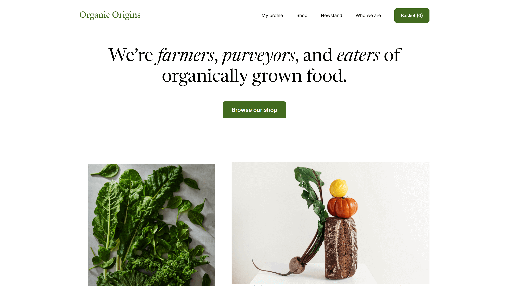

# 🥦 Organic Origins

A concept landing page for an organic grocery brand. Includes animated interactions, basic e-commerce simulation, and responsive design. Built with semantic HTML, modular CSS, and interactive JavaScript.

**🔗 Live Demo**: [Organic Origins](https://dobbyssockk.github.io/organic-origins/)

---

## 🌿 Project Overview

Organic Origins is a front-end demo simulating a simple organic produce store. It features a shopping basket, navigation toggles, form interactions, and local storage usage for cart functionality.

---

## 🚀 Features

- Animated UI with smooth open/close transitions
- Responsive mobile-friendly layout
- Basket simulation with local storage
- Login/register form toggle with overlays
- Navigation toggle for small screens
- Product section scroll targeting via buttons

---

## 🛠️ Technologies Used

- **HTML5** – semantic structure
- **CSS3** – modular BEM-based design
- **JavaScript (ES6+)** – interactive logic, UI toggles, local storage
- **CSS Libraries**:
  - `normalize.css` – reset styles
  - `animate.css` and `wow.js` – element animations
- **Google Fonts** – `Inter` and `Newsreader` for polished typography

---

## 💡 Key Concepts

- **BEM methodology**: scalable CSS component structure
- **Event-driven interaction**: menu toggles, form switching, and buttons
- **Local storage usage**: simulated basket state persistence
- **Overlay handling**: login/signup UI management
- **DOM manipulation**: updates to navigation, forms, and basket display
- **Responsive design**: optimized for desktop and mobile
